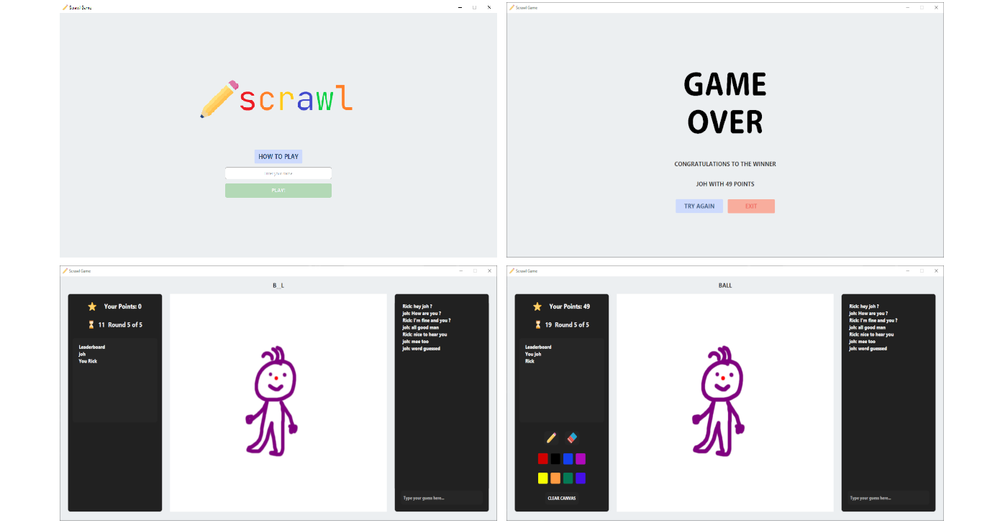

# squiggle 

## Java Project

Based on RMI (Remote Method Invocation) implementation, this project lets the clients communicate among them through a Server.
RMI creates a connection between Client, Shared and Server, so that a client can draw a picture, and the other users/clients can enjoy guessing the correct corresponding word.

- When a user enters the game, he/she will wait for the other user to join, so that they can play together.

- The Client that has temporary command is able to see the word and has some seconds to draw it as he/she wants to, using colors, and the pad available.

- The other gamers have the goal to guess the right word corresponding to the picture that they see.
  The Client's control of drawing and guessing switches every round.
  The first one to guess will get 49 points; the second 39, and the third 33 points.

- The winner is the one who has accumulated more points at the end of the game.

## This is how you use my Project

**NOTE**: In order to run this project you will only need Java 15 or above.

The commands listed below invoke Maven through the Maven Wrapper. On Linux/macOS, replace
``mvnw.cmd`` with ``./mvnw``.

In any OS, to invoke your local Maven installation instead of the wrapper, replace
``mvnw.cmd`` or ``./mvnw`` with ``mvn``.

To check your Java version, run:
``
$ java --version
``

**Here is a list of things to do:**

  - To clone the **repo** run:

    ``
     $ git clone https://gitlab.inf.unibz.it/Oussama.Driouache/pp_202021_misterycrew_id36129.git
    ``
    

  - To access the **repo** run:

    ``
    $ cd pp_202021_misterycrew_id36129
    ``
    

  - To **compile**, **package** and **install** run:

    ``
    $ mvnw.cmd install
    ``
    

  - To access the **Server** folder run:

    ``
    $ cd Server
    ``
    

  - To execute the **Server** run:

    ``
    $ java -jar target/Server-1.0-SNAPSHOT-jar-with-dependencies.jar
    ``

**New terminal session**

  - To access the **repo** run:

    ``
    $ cd pp_202021_misterycrew_id36129
    ``
    

  - To execute the **javafx** Application run: 

    ``
    $ mvnw.cmd -pl ApplicationFX javafx:run
    ``
    
Now open another terminal and repeat step 6(access the **repo**) and 7(execute **javafx**) to test the application
(Since this is a distributed Version).

**REMEMBER:** open the server and the ApplicationFX in different terminals
and in the order in which are specified in the "list of things to do".

P.s: To shut down the server hold Ctrl + C (please also make sure to 
close all the ApplicationFX before the server).

**MORE COMMANDS**

- To generate the **java documentation**, run:

  ``
  $ mvnw.cmd javadoc:javadoc
  ``

- To **clean** the built files, run:

  ``
  $ mvnw.cmd clean
  ``

Enjoy the Game :)

# Issues tracking 

Pull requests are welcome. For major changes, please open an [issue](https://github.com/NinjaCoder90/squiggle/issues) first to discuss what you would like to change
or which bug/issue you encountered.

# References

- https://docs.oracle.com/javase/7/docs/technotes/guides/rmi/hello/hello-world.html
- https://www.baeldung.com/java-rmi

# Future features

- [ ] Possibility to create a private game room to invite friends with a private url.
- [ ] Possibility to votekick a player from the game session.
- [ ] Hosting the game on an a server rather than the localhost (maybe using socket.io).

# Resources

Icons from [Flaticon](https://www.flaticon.com/) by [Freepik](https://it.freepik.com/)
