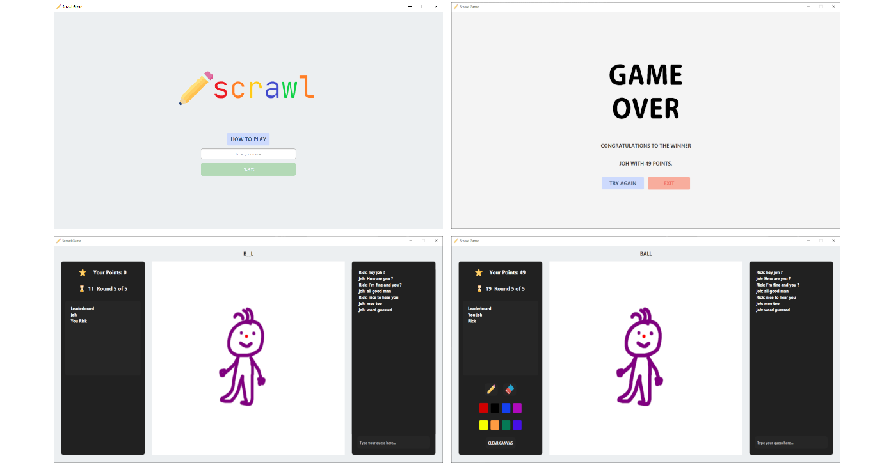

# Scrawl Game  

## Our Java Project

Based on RMI (Remote Method Invocation) implementation, this project lets the clients communicate among them through a Server.
RMI creates a connection between Client, Shared and Server, so that a client can draw a picture, and the other users/clients can enjoy guessing the correct corresponding word.

- When a user enters the game, he/she will wait for the other user to join, so that they can play together.

- The Client that has temporary command is able to see the word and has some seconds to draw it as he/she wants to, using colors, and the pad available.

- The others gamers have the goal to guess the right word corresponding to the picture that they see.
  The Client's control of drawing and guessing switches every round.
  The first one to guess will get 49 points; the second 39, and the third 33 points.

- The winner is the one who has accumulated more points at the end of the game.

## This is how you use my Project

**NOTE**: In order to run this project you will only need Java 15 or above.

The commands listed below invoke Maven through the Maven Wrapper. On Linux/macOS, replace
``mvnw.cmd`` with ``./mvnw``.

In any OS, to invoke your local Maven installation instead of the wrapper, replace
``mvnw.cmd`` or ``./mvnw`` with ``mvn``.

To check your Java version, run:
``
$ java --version
``

**Here is a list of things to do:**

  - To clone the **repo**

    ``
     $ git clone https://gitlab.inf.unibz.it/Oussama.Driouache/pp_202021_misterycrew_id36129.git
    ``
    

  - To access the **repo**

    ``
    $ cd pp_202021_misterycrew_id36129
    ``
    

  - To **compile**, **package** and **install**

    ``
    $ mvnw.cmd install
    ``
    

  - To access the **Server** folder

    ``
    $ cd Server
    ``
    

  - To execute the **Server**

    ``
    $ java -jar target/Server-1.0-SNAPSHOT-jar-with-dependencies.jar
    ``

**New terminal session**

  - To access the **repo**

    ``
    $ cd pp_202021_misterycrew_id36129
    ``
    

  - To execute the **javafx** Application  

    ``
    $ mvnw.cmd -pl ApplicationFX javafx:run
    ``
    
Now open another terminal and repeat step 6(access the **repo**) and 7(execute **javafx**) to test the application
(Since this is a distributed Version).

**REMEMBER:** open the server and the ApplicationFX in different terminals
and in the order in which are specified in the "list of things to do".

P.s: To shut down the server hold Ctrl + C (please also make sure to 
close all the ApplicationFX before the server).

**MORE COMMANDS**

- To generate the **java documentation**, run:

  ``
  $ mvnw.cmd javadoc:javadoc
  ``

- To **clean** the built files, run:

  ``
  $ mvnw.cmd clean
  ``

Enjoy the Game :)

## These are my dependencies

1. Java

## Programming Techniques used

- Interfaces
- Generics (methods or classes)
- Exception handling
- Method overriding
- Lambdas
- File I/O
- Test hooks
- Streams
- Asynchronous programming
- Collections

## Experience in this project

• How you organized yourselves to work on it?

> **Oussama Driouache:** 
  First I searched for ways to permit the communication between different JVM, and then I have started to
  develop it. Afterwards, I started building up the javafx layout with the different panes. 

> **Emanuele Pippa:**
  After Oussama proposed this type of project/game, we looked for information about it on web-sites, 
  trying to understand how to work and how to implement RMI (Remote Method Invocation). Nevertheless, the final 
  solution has been found by my colleague Oussama. In the development of this game I wrote some methods, 
  like assigning points, worked on finding bugs and errors during the implementation and helped
  fixing them.

• How you used Git?
  
> Mainly we used **Git** to better manage the different features of the project that we wanted to 
  implement by creating branches and then discussing together which feature was most suited to get the job done correctly. Finally, we merged the branches into the master branch. 

• The main challenges you faced (at least one per member)?

> **Oussama Driouache:**
  As far as I'm concerned the main challenge that I have 
  faced was using the RMI(Remote Method Invocation) used to communicate between
  client and Server, and passing objects from the server to the clients, since I have never developed nor used distributed version 
  architecture. Another challenge that I have faced was setting up maven,
  since this is a distributed version having the server, and the Application javafx we had to create
  submodules with a parent maven project with which each one of the modules having his own pom.xml file. Apart from this the project was really challenging and at the same time fun to develop.

> **Emanuele Pippa:**
  The main difficulty I met was the RMI: After knew the concepts, the main problem was to write it, 
  and it was always full of some unknown problem; without mention my IDE had SDK and JavaVersion issues. 
  Another challenge, but much easier to fix it, was to implement methods distinguishing the Clients: the solution we 
  used is looking everytime who made the access, the name he used and the order in which clients acted during the game.
# Issues tracking 

Pull requests are welcome. For major changes, please open an [issue](https://gitlab.inf.unibz.it/Oussama.Driouache/pp_202021_misterycrew_id36129/-/issues) first to discuss what you would like to change
or which bug/issue you encountered.

# The contributors of this project are

1. Oussama Driouache
2. Emanuele Pippa
3. Emmanuel Scopelliti
